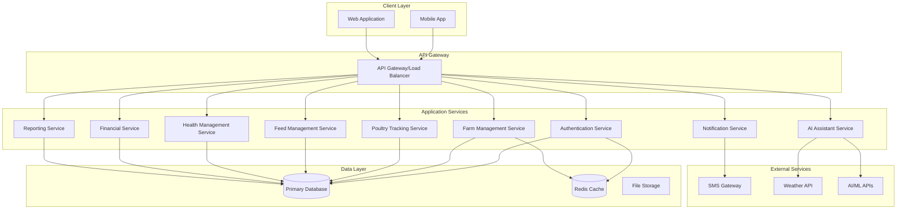

# PoultryMitra AI System Design

## Overview

PoultryMitra AI is a comprehensive farm management platform designed specifically for Indian poultry farmers. The system provides digital tools for managing farm operations, tracking poultry health and production, financial management, and AI-powered assistance. The platform supports both Desi and Commercial poultry breeds and operates effectively in rural Indian conditions with limited connectivity.

## Architecture

### High-Level Architecture

The system follows a modern cloud-native architecture with offline-first capabilities:



### Core Architectural Principles

1. **Offline-First Design**: Critical operations work without internet connectivity
2. **Mobile-Optimized**: Touch-friendly interfaces with fast loading times
3. **Multi-Language Support**: Full localization for Indian languages
4. **Scalable Microservices**: Independent services for different functional areas
5. **Security-First**: End-to-end encryption and role-based access control
6. **Rural-Friendly**: Optimized for low-bandwidth and intermittent connectivity

## Components and Interfaces

### 1. Authentication Service

**Responsibilities:**
- User registration and login
- JWT token management
- Role-based access control
- Session management
- Password security

**Key Interfaces:**
```typescript
interface AuthenticationService {
  register(userData: UserRegistrationData): Promise<AuthResult>
  login(credentials: LoginCredentials): Promise<AuthResult>
  validateToken(token: string): Promise<TokenValidation>
  refreshToken(refreshToken: string): Promise<AuthResult>
  logout(userId: string): Promise<void>
  changePassword(userId: string, oldPassword: string, newPassword: string): Promise<void>
}

interface UserRegistrationData {
  name: string
  email: string
  phoneNumber: string
  password: string
  farmName: string
  location: string
  preferredLanguage: SupportedLanguage
}

interface AuthResult {
  success: boolean
  user?: User
  accessToken?: string
  refreshToken?: string
  error?: string
}
```

### 2. Farm Management Service

**Responsibilities:**
- Farm profile management
- Batch creation and tracking
- Breed classification (Desi/Commercial)
- Farm-level analytics

**Key Interfaces:**
```typescript
interface FarmManagementService {
  createFarm(farmData: FarmData): Promise<Farm>
  updateFarm(farmId: string, updates: Partial<FarmData>): Promise<Farm>
  getFarmDetails(farmId: string): Promise<Farm>
  createBatch(batchData: BatchData): Promise<Batch>
  updateBatch(batchId: string, updates: Partial<BatchData>): Promise<Batch>
  getBatchDetails(batchId: string): Promise<BatchDetails>
  listBatches(farmId: string, filters?: BatchFilters): Promise<Batch[]>
}

interface BatchData {
  farmId: string
  breedType: BreedType
  initialCount: number
  startDate: Date
  expectedProductionStart?: Date
  notes?: string
}

enum BreedType {
  DESI_POULTRY = 'DESI_POULTRY',
  COMMERCIAL_POULTRY = 'COMMERCIAL_POULTRY'
}
```

### 3. Poultry Tracking Service

**Responsibilities:**
- Bird count tracking
- Mortality logging
- Egg production records
- Production analytics

**Key Interfaces:**
```typescript
interface PoultryTrackingService {
  recordProduction(productionData: ProductionRecord): Promise<void>
  recordMortality(mortalityData: MortalityRecord): Promise<void>
  updateBirdCount(batchId: string, newCount: number, reason: string): Promise<void>
  getProductionSummary(batchId: string, period: TimePeriod): Promise<ProductionSummary>
  getProductionTrends(batchId: string): Promise<ProductionTrend[]>
}

interface ProductionRecord {
  batchId: string
  date: Date
  eggCount: number
  birdCount: number
  notes?: string
}

interface MortalityRecord {
  batchId: string
  date: Date
  count: number
  cause?: string
  notes?: string
}
```

### 4. Feed Management Service

**Responsibilities:**
- Daily feed consumption tracking
- Feed cost calculation
- Feed inventory management
- Feed efficiency analytics

**Key Interfaces:**
```typescript
interface FeedManagementService {
  recordFeedConsumption(feedData: FeedConsumptionRecord): Promise<void>
  updateFeedPrices(priceUpdates: FeedPriceUpdate[]): Promise<void>
  calculateFeedCosts(batchId: string, period: TimePeriod): Promise<FeedCostSummary>
  getFeedEfficiency(batchId: string): Promise<FeedEfficiencyMetrics>
  generateFeedRecommendations(batchId: string): Promise<FeedRecommendation[]>
}

interface FeedConsumptionRecord {
  batchId: string
  date: Date
  feedType: string
  quantity: number
  costPerUnit: number
  notes?: string
}

interface FeedEfficiencyMetrics {
  feedConversionRatio: number
  costPerEgg: number
  costPerBird: number
  efficiency: number
}
```

### 5. Health Management Service

**Responsibilities:**
- Vaccination schedule management
- Health alerts and reminders
- Disease tracking
- Health protocol compliance

**Key Interfaces:**
```typescript
interface HealthManagementService {
  createVaccinationSchedule(batchId: string, breedType: BreedType): Promise<VaccinationSchedule>
  recordVaccination(vaccinationRecord: VaccinationRecord): Promise<void>
  recordHealthIssue(healthIssue: HealthIssueRecord): Promise<void>
  getUpcomingVaccinations(farmId: string): Promise<VaccinationReminder[]>
  getHealthSummary(batchId: string): Promise<HealthSummary>
  generateHealthAlerts(batchId: string): Promise<HealthAlert[]>
}

interface VaccinationRecord {
  batchId: string
  vaccineName: string
  dateAdministered: Date
  dosage: string
  veterinarianName?: string
  notes?: string
}

interface HealthIssueRecord {
  batchId: string
  date: Date
  symptoms: string[]
  treatment?: string
  outcome?: string
  affectedBirds: number
}
```

### 6. Financial Service

**Responsibilities:**
- Expense tracking
- Revenue calculation
- Profit and loss analysis
- Financial reporting

**Key Interfaces:**
```typescript
interface FinancialService {
  recordExpense(expense: ExpenseRecord): Promise<void>
  recordRevenue(revenue: RevenueRecord): Promise<void>
  calculateProfitLoss(farmId: string, period: TimePeriod): Promise<ProfitLossReport>
  getFinancialSummary(farmId: string): Promise<FinancialSummary>
  generateFinancialRecommendations(farmId: string): Promise<FinancialRecommendation[]>
}

interface ExpenseRecord {
  farmId: string
  batchId?: string
  date: Date
  category: ExpenseCategory
  amount: number
  description: string
  receipt?: string
}

enum ExpenseCategory {
  FEED = 'FEED',
  MEDICATION = 'MEDICATION',
  LABOR = 'LABOR',
  UTILITIES = 'UTILITIES',
  EQUIPMENT = 'EQUIPMENT',
  OTHER = 'OTHER'
}
```

### 7. AI Assistant Service

**Responsibilities:**
- Chatbot for poultry-related queries
- Disease prevention guidance
- Best practice recommendations
- Contextual farm advice

**Key Interfaces:**
```typescript
interface AIAssistantService {
  processQuery(query: AIQuery): Promise<AIResponse>
  generateRecommendations(farmContext: FarmContext): Promise<AIRecommendation[]>
  analyzeFarmData(farmId: string): Promise<FarmAnalysis>
  getWeatherBasedAdvice(location: string): Promise<WeatherAdvice>
}

interface AIQuery {
  userId: string
  farmId: string
  message: string
  language: SupportedLanguage
  context?: QueryContext
}

interface AIResponse {
  message: string
  recommendations?: string[]
  followUpQuestions?: string[]
  confidence: number
}
```

### 8. Reporting Service

**Responsibilities:**
- Monthly farm performance reports
- Exportable data
- Custom report generation
- Data visualization

**Key Interfaces:**
```typescript
interface ReportingService {
  generateMonthlyReport(farmId: string, month: Date): Promise<MonthlyReport>
  generateCustomReport(reportConfig: ReportConfiguration): Promise<CustomReport>
  exportData(exportConfig: ExportConfiguration): Promise<ExportResult>
  getReportTemplates(): Promise<ReportTemplate[]>
}

interface MonthlyReport {
  farmId: string
  period: TimePeriod
  productionSummary: ProductionSummary
  financialSummary: FinancialSummary
  healthSummary: HealthSummary
  recommendations: string[]
}
```

### 9. Notification Service

**Responsibilities:**
- Push notifications
- SMS alerts
- Email notifications
- Reminder management

**Key Interfaces:**
```typescript
interface NotificationService {
  sendNotification(notification: NotificationRequest): Promise<NotificationResult>
  scheduleReminder(reminder: ReminderRequest): Promise<void>
  updateNotificationPreferences(userId: string, preferences: NotificationPreferences): Promise<void>
  getNotificationHistory(userId: string): Promise<NotificationHistory[]>
}

interface NotificationRequest {
  userId: string
  type: NotificationType
  title: string
  message: string
  priority: Priority
  channels: NotificationChannel[]
  language: SupportedLanguage
}
```

## Data Models

### Core Entities

```typescript
interface User {
  id: string
  name: string
  email: string
  phoneNumber: string
  role: UserRole
  preferredLanguage: SupportedLanguage
  createdAt: Date
  lastLoginAt?: Date
  isActive: boolean
}

interface Farm {
  id: string
  userId: string
  name: string
  location: {
    address: string
    coordinates?: {
      latitude: number
      longitude: number
    }
  }
  size: number // in square feet
  establishedDate: Date
  farmType: FarmType
  createdAt: Date
  updatedAt: Date
}

interface Batch {
  id: string
  farmId: string
  breedType: BreedType
  initialCount: number
  currentCount: number
  startDate: Date
  expectedProductionStart?: Date
  actualProductionStart?: Date
  status: BatchStatus
  notes?: string
  createdAt: Date
  updatedAt: Date
}

interface ProductionRecord {
  id: string
  batchId: string
  date: Date
  eggCount: number
  birdCount: number
  productionRate: number
  notes?: string
  createdAt: Date
}

interface FeedRecord {
  id: string
  batchId: string
  date: Date
  feedType: string
  quantity: number
  costPerUnit: number
  totalCost: number
  supplier?: string
  notes?: string
  createdAt: Date
}

interface HealthRecord {
  id: string
  batchId: string
  type: HealthRecordType
  date: Date
  details: any // Flexible structure for different health record types
  veterinarianName?: string
  cost?: number
  notes?: string
  createdAt: Date
}

interface FinancialRecord {
  id: string
  farmId: string
  batchId?: string
  type: TransactionType
  category: string
  amount: number
  date: Date
  description: string
  receipt?: string
  createdAt: Date
}
```

### Supporting Types

```typescript
enum UserRole {
  FARMER = 'FARMER',
  ADMIN = 'ADMIN',
  VETERINARIAN = 'VETERINARIAN'
}

enum SupportedLanguage {
  ENGLISH = 'en',
  HINDI = 'hi',
  TAMIL = 'ta',
  TELUGU = 'te'
}

enum FarmType {
  LAYER_FARM = 'LAYER_FARM',
  BROILER_FARM = 'BROILER_FARM',
  MIXED_FARM = 'MIXED_FARM'
}

enum BatchStatus {
  ACTIVE = 'ACTIVE',
  COMPLETED = 'COMPLETED',
  TERMINATED = 'TERMINATED'
}

enum HealthRecordType {
  VACCINATION = 'VACCINATION',
  DISEASE = 'DISEASE',
  TREATMENT = 'TREATMENT',
  MORTALITY = 'MORTALITY'
}

enum TransactionType {
  INCOME = 'INCOME',
  EXPENSE = 'EXPENSE'
}
```

### Database Schema Design

The system uses PostgreSQL as the primary database with the following key design principles:

1. **Normalization**: Proper normalization to reduce data redundancy
2. **Indexing**: Strategic indexing for query performance
3. **Partitioning**: Time-based partitioning for large tables
4. **Audit Trail**: Comprehensive audit logging for all critical operations
5. **Soft Deletes**: Soft deletion for data recovery capabilities

Key tables and relationships:
- Users (1:N) Farms
- Farms (1:N) Batches
- Batches (1:N) ProductionRecords, FeedRecords, HealthRecords
- Farms (1:N) FinancialRecords
- All tables include audit fields (created_at, updated_at, created_by, updated_by)
## Correctness Properties

*A property is a characteristic or behavior that should hold true across all valid executions of a system-essentially, a formal statement about what the system should do. Properties serve as the bridge between human-readable specifications and machine-verifiable correctness guarantees.*

### Property Reflection

After analyzing all acceptance criteria from the prework analysis, several properties can be consolidated to eliminate redundancy:

- User management properties (1.1, 1.2, 1.3) can be combined into comprehensive authentication and authorization properties
- Farm and batch management properties (2.1, 2.2, 2.3) share similar CRUD patterns and can be consolidated
- Tracking properties (3.1, 3.2, 3.3) all involve data recording and can be combined into data integrity properties
- Financial properties (5.1, 5.2, 5.3) follow similar calculation patterns
- AI assistant properties (7.1, 7.2, 7.3) can be consolidated into contextual response properties
- Report properties (8.1, 8.2) can be combined into comprehensive reporting properties

### Core Properties

#### Property 1: User Authentication and Authorization
*For any* user registration data, login credentials, or access attempt, the Authentication_System should create secure accounts with encrypted passwords, establish proper sessions for valid credentials, enforce role-based access control, and deny unauthorized access attempts.
**Validates: Requirements 1.1, 1.2, 1.3**

#### Property 2: Farm and Batch Data Integrity
*For any* farm or batch creation, update, or deletion operation, the System should maintain data integrity, validate all required fields, preserve referential integrity between farms and batches, and support both Desi and Commercial breed classifications with appropriate functionality.
**Validates: Requirements 2.1, 2.2, 2.3**

#### Property 3: Poultry Tracking Data Consistency
*For any* bird count update, mortality record, or egg production entry, the System should maintain accurate counts, update totals correctly, preserve historical data, and calculate production rates accurately.
**Validates: Requirements 3.1, 3.2, 3.3**

#### Property 4: Feed Management Accuracy
*For any* feed consumption record or cost calculation, the System should accurately track consumption, calculate costs based on current and historical prices, maintain feed efficiency metrics, and update batch totals correctly.
**Validates: Requirements 4.1, 4.2**

#### Property 5: Financial Calculation Completeness
*For any* expense record, revenue entry, or profit/loss calculation, the System should accurately categorize transactions, calculate financial metrics, generate comprehensive reports, and maintain historical financial data.
**Validates: Requirements 5.1, 5.2, 5.3**

#### Property 6: Health Management Compliance
*For any* vaccination schedule creation or health record entry, the System should generate appropriate schedules based on breed requirements, send timely reminders, track compliance, and maintain comprehensive health histories.
**Validates: Requirements 6.1, 6.2**

#### Property 7: AI Assistant Contextual Intelligence
*For any* farming query, problem report, or farm data analysis, the AI_Assistant should provide contextually relevant responses considering Indian poultry practices, breed characteristics, local conditions, and farm-specific data to deliver helpful guidance and recommendations.
**Validates: Requirements 7.1, 7.2, 7.3**

#### Property 8: Comprehensive Reporting and Export
*For any* report generation or data export request, the System should compile accurate data from all relevant sources, generate comprehensive reports with proper calculations, and export data while maintaining integrity and completeness.
**Validates: Requirements 8.1, 8.2**

## Error Handling

### Error Categories and Response Strategies

#### 1. Authentication and Authorization Errors
```typescript
enum AuthError {
  INVALID_CREDENTIALS = 'INVALID_CREDENTIALS',
  SESSION_EXPIRED = 'SESSION_EXPIRED',
  ACCOUNT_LOCKED = 'ACCOUNT_LOCKED',
  INSUFFICIENT_PERMISSIONS = 'INSUFFICIENT_PERMISSIONS',
  WEAK_PASSWORD = 'WEAK_PASSWORD',
  EMAIL_ALREADY_EXISTS = 'EMAIL_ALREADY_EXISTS'
}

// Strategy: Return specific error codes, implement rate limiting, log security events
// Multi-language error messages, account lockout after failed attempts
```

#### 2. Data Validation Errors
```typescript
enum ValidationError {
  REQUIRED_FIELD_MISSING = 'REQUIRED_FIELD_MISSING',
  INVALID_DATA_FORMAT = 'INVALID_DATA_FORMAT',
  DATA_OUT_OF_RANGE = 'DATA_OUT_OF_RANGE',
  DUPLICATE_ENTRY = 'DUPLICATE_ENTRY',
  INVALID_BREED_TYPE = 'INVALID_BREED_TYPE',
  NEGATIVE_COUNT = 'NEGATIVE_COUNT',
  FUTURE_DATE_NOT_ALLOWED = 'FUTURE_DATE_NOT_ALLOWED'
}

// Strategy: Client-side and server-side validation, clear error messages in user's language
// Field-specific error highlighting, data integrity preservation
```

#### 3. Business Logic Errors
```typescript
enum BusinessError {
  INSUFFICIENT_BIRD_COUNT = 'INSUFFICIENT_BIRD_COUNT',
  BATCH_ALREADY_COMPLETED = 'BATCH_ALREADY_COMPLETED',
  VACCINATION_ALREADY_RECORDED = 'VACCINATION_ALREADY_RECORDED',
  INVALID_PRODUCTION_DATE = 'INVALID_PRODUCTION_DATE',
  FEED_CONSUMPTION_EXCEEDS_CAPACITY = 'FEED_CONSUMPTION_EXCEEDS_CAPACITY'
}

// Strategy: Business rule validation, contextual error messages, suggested corrections
```

#### 4. System and Infrastructure Errors
```typescript
enum SystemError {
  DATABASE_CONNECTION_FAILED = 'DATABASE_CONNECTION_FAILED',
  EXTERNAL_SERVICE_UNAVAILABLE = 'EXTERNAL_SERVICE_UNAVAILABLE',
  INSUFFICIENT_STORAGE = 'INSUFFICIENT_STORAGE',
  RATE_LIMIT_EXCEEDED = 'RATE_LIMIT_EXCEEDED',
  AI_SERVICE_TIMEOUT = 'AI_SERVICE_TIMEOUT',
  SMS_DELIVERY_FAILED = 'SMS_DELIVERY_FAILED'
}

// Strategy: Retry mechanisms, graceful degradation, fallback services
// User-friendly error messages, automatic recovery where possible
```

#### 5. Offline and Synchronization Errors
```typescript
enum SyncError {
  CONFLICT_DETECTED = 'CONFLICT_DETECTED',
  NETWORK_TIMEOUT = 'NETWORK_TIMEOUT',
  DATA_CORRUPTION = 'DATA_CORRUPTION',
  VERSION_MISMATCH = 'VERSION_MISMATCH',
  SYNC_QUEUE_FULL = 'SYNC_QUEUE_FULL'
}

// Strategy: Conflict resolution UI, automatic retry with exponential backoff
// Data integrity checks, manual conflict resolution options
```

### Error Recovery Mechanisms

1. **Automatic Retry with Exponential Backoff**
   - Network failures: 3 retries with 1s, 2s, 4s delays
   - External service calls: 5 retries with jitter
   - Database operations: 2 retries with connection pool refresh

2. **Graceful Degradation**
   - Offline mode when connectivity is lost
   - Cached data display when real-time data unavailable
   - Basic functionality when AI services are down
   - SMS fallback when push notifications fail

3. **User-Friendly Error Communication**
   - Error messages in user's preferred language
   - Contextual help and suggested actions
   - Clear indication of temporary vs permanent issues
   - Progress indicators for recovery operations

4. **Data Recovery and Backup**
   - Automatic local data backup before sync
   - Point-in-time recovery for critical data
   - Manual data export capabilities
   - Rollback mechanisms for failed operations

5. **Monitoring and Alerting**
   - Real-time error monitoring and alerting
   - Performance metrics tracking
   - User experience impact assessment
   - Proactive issue detection and resolution

## Testing Strategy

### Dual Testing Approach

The testing strategy employs both unit testing and property-based testing to ensure comprehensive coverage:

**Unit Tests**: Focus on specific examples, edge cases, and error conditions
- Authentication flows with specific credential combinations
- Data validation with boundary values and edge cases
- Error handling scenarios and recovery mechanisms
- Integration points between services
- Mobile UI responsiveness on specific devices
- Multi-language functionality with specific language combinations

**Property Tests**: Verify universal properties across all inputs
- Authentication security across all valid/invalid credential combinations
- Data integrity across all CRUD operations for farms, batches, and records
- Cost calculations across all possible input ranges and scenarios
- Multi-language support across all supported languages and content types
- Offline synchronization across all data types and conflict scenarios
- AI assistant responses across different query types and farm contexts

### Property-Based Testing Configuration

**Testing Library**: fast-check for JavaScript/TypeScript property-based testing
**Test Configuration**: Minimum 100 iterations per property test
**Test Tagging**: Each property test references its design document property

Example property test structure:
```typescript
// Feature: poultry-mitra-ai, Property 1: User Authentication and Authorization
describe('User Authentication and Authorization', () => {
  it('should handle all authentication scenarios securely', () => {
    fc.assert(fc.property(
      fc.record({
        name: fc.string({ minLength: 2, maxLength: 50 }),
        email: fc.emailAddress(),
        password: fc.string({ minLength: 8, maxLength: 128 }),
        phoneNumber: fc.string({ minLength: 10, maxLength: 15 }),
        farmName: fc.string({ minLength: 1, maxLength: 100 }),
        preferredLanguage: fc.constantFrom('en', 'hi', 'ta', 'te')
      }),
      async (userData) => {
        // Test registration
        const registerResult = await authService.register(userData)
        expect(registerResult.success).toBe(true)
        expect(registerResult.user.passwordHash).not.toBe(userData.password)
        
        // Test login
        const loginResult = await authService.login({
          email: userData.email,
          password: userData.password
        })
        expect(loginResult.success).toBe(true)
        expect(loginResult.accessToken).toBeDefined()
        
        // Test authorization
        const protectedResource = await farmService.getFarmDetails(
          'test-farm-id',
          loginResult.accessToken
        )
        expect(protectedResource).toBeDefined()
      }
    ), { numRuns: 100 })
  })
})

// Feature: poultry-mitra-ai, Property 3: Poultry Tracking Data Consistency
describe('Poultry Tracking Data Consistency', () => {
  it('should maintain accurate counts and data consistency', () => {
    fc.assert(fc.property(
      fc.record({
        initialCount: fc.integer({ min: 100, max: 10000 }),
        mortalityCount: fc.integer({ min: 0, max: 50 }),
        eggCount: fc.integer({ min: 0, max: 1000 }),
        date: fc.date({ min: new Date('2020-01-01'), max: new Date() })
      }),
      async (trackingData) => {
        const batch = await createTestBatch(trackingData.initialCount)
        
        // Record mortality
        await poultryService.recordMortality({
          batchId: batch.id,
          date: trackingData.date,
          count: trackingData.mortalityCount
        })
        
        // Record production
        await poultryService.recordProduction({
          batchId: batch.id,
          date: trackingData.date,
          eggCount: trackingData.eggCount,
          birdCount: trackingData.initialCount - trackingData.mortalityCount
        })
        
        // Verify consistency
        const updatedBatch = await farmService.getBatchDetails(batch.id)
        expect(updatedBatch.currentCount).toBe(
          trackingData.initialCount - trackingData.mortalityCount
        )
        
        const productionSummary = await poultryService.getProductionSummary(
          batch.id,
          { start: trackingData.date, end: trackingData.date }
        )
        expect(productionSummary.totalEggs).toBe(trackingData.eggCount)
      }
    ), { numRuns: 100 })
  })
})
```

### Testing Coverage Areas

#### 1. Functional Testing
- **User Management**: Registration, login, profile updates, role-based access
- **Farm Operations**: Farm creation, batch management, breed classification
- **Data Recording**: Production tracking, feed consumption, health records
- **Financial Management**: Expense tracking, revenue calculation, P&L reports
- **AI Assistant**: Query processing, recommendations, contextual responses
- **Reporting**: Report generation, data export, multi-format support
- **Multi-language**: Interface translation, content localization, cultural adaptation

#### 2. Integration Testing
- **API Integration**: All REST endpoints with various input combinations
- **Database Operations**: CRUD operations, transactions, data consistency
- **External Services**: SMS gateway, weather APIs, AI/ML services
- **Real-time Features**: Notifications, alerts, live data updates
- **Cross-service Communication**: Service-to-service interactions

#### 3. Performance Testing
- **Mobile Performance**: Loading times, responsiveness, memory usage
- **Scalability**: Concurrent users, large datasets, high-volume operations
- **Offline Performance**: Local storage, sync performance, conflict resolution
- **Network Conditions**: Low bandwidth, intermittent connectivity, high latency

#### 4. Security Testing
- **Authentication Security**: Password policies, session management, token validation
- **Authorization Testing**: Role-based access, resource protection, privilege escalation
- **Data Protection**: Encryption verification, secure transmission, data privacy
- **Input Validation**: SQL injection, XSS prevention, malicious input handling
- **API Security**: Rate limiting, CORS policies, secure headers

#### 5. Usability and Accessibility Testing
- **Mobile Usability**: Touch interfaces, gesture support, screen size adaptation
- **Multi-language UX**: Text expansion, RTL support, cultural appropriateness
- **Accessibility**: Screen reader compatibility, keyboard navigation, color contrast
- **Rural Context**: Low-literacy interfaces, icon-based navigation, voice support

#### 6. Offline and Synchronization Testing
- **Offline Functionality**: Data entry, local storage, cached operations
- **Sync Reliability**: Conflict detection, resolution mechanisms, data integrity
- **Network Recovery**: Automatic reconnection, queue processing, error handling
- **Data Consistency**: Multi-device sync, concurrent modifications, version control

### Test Data Management

**Test Data Strategy**:
- **Synthetic Data Generation**: Property-based test data for comprehensive coverage
- **Realistic Scenarios**: Farm data patterns based on Indian poultry practices
- **Multi-language Content**: Test data in all supported languages
- **Edge Cases**: Boundary conditions, extreme values, unusual combinations
- **Performance Data**: Large datasets for scalability testing

**Data Privacy and Security**:
- **No Real Data**: Synthetic data only in test environments
- **Data Anonymization**: Realistic patterns without personal information
- **Secure Cleanup**: Automatic test data removal after test completion
- **Compliance Testing**: Data protection regulation compliance verification

### Continuous Testing Pipeline

1. **Unit Tests**: Run on every code commit
2. **Integration Tests**: Run on pull requests and daily builds
3. **Property Tests**: Run nightly with extended iteration counts
4. **Performance Tests**: Run weekly on staging environment
5. **Security Tests**: Run on security-focused builds and releases
6. **User Acceptance Tests**: Manual testing with real user scenarios

This comprehensive testing strategy ensures that PoultryMitra AI meets all functional requirements while maintaining high quality, security, and performance standards across all supported platforms, languages, and usage scenarios.