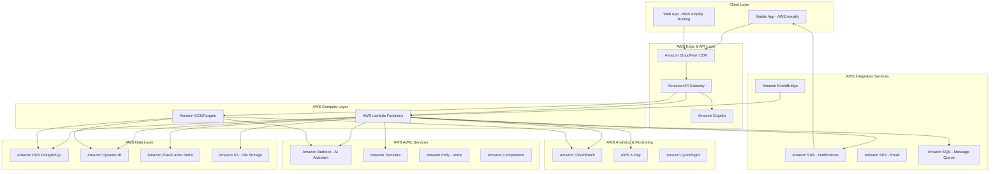

# PoultryMitra AI System Design - Powered by AWS

**AI for Bharat – Powered by AWS**

## Overview

PoultryMitra AI is a comprehensive farm management platform designed specifically for Indian poultry farmers, built entirely on AWS cloud infrastructure. The system provides digital tools for managing farm operations, tracking poultry health and production, financial management, and AI-powered assistance using Amazon Bedrock. The platform supports both Desi and Commercial poultry breeds and operates effectively in rural Indian conditions with limited connectivity through AWS Amplify's offline-first architecture.

**AWS-Powered Innovation:**
- **Amazon Bedrock AI**: Multilingual conversational AI for farming guidance in Hindi, Tamil, Telugu, and English
- **AWS Amplify**: Offline-first mobile experience with automatic cloud synchronization
- **Serverless Architecture**: Cost-effective scaling from 10 to 10,000+ farmers using AWS Lambda
- **Mumbai Region**: Low-latency access for Indian farmers with AWS Asia Pacific (Mumbai) infrastructure
- **Rural Optimization**: CloudFront edge caching and optimized for intermittent connectivity

## Architecture

### High-Level Architecture

The system leverages AWS cloud services for a scalable, secure, and cost-effective architecture optimized for Indian rural conditions with offline-first capabilities:



### Core Architectural Principles

1. **AWS-Native Cloud Architecture**: Leveraging managed AWS services for scalability and reliability
2. **Serverless-First**: AWS Lambda and Fargate for cost-effective, auto-scaling compute
3. **Offline-First Design**: AWS Amplify DataStore for seamless offline/online sync
4. **AI-Powered**: Amazon Bedrock for multilingual AI assistance with Indian context
5. **Security-First**: AWS Cognito, IAM, and encryption services for comprehensive security
6. **Rural-Optimized**: CloudFront edge locations and optimized for low-bandwidth scenarios
7. **Cost-Effective**: Pay-per-use AWS services ideal for growing farmer base

## Technology Stack - AWS-Powered

### Frontend
- **Framework**: React.js with TypeScript
- **Styling**: Tailwind CSS
- **State Management**: AWS Amplify DataStore
- **Hosting**: AWS Amplify Hosting with CI/CD
- **CDN**: Amazon CloudFront for global delivery
- **Offline Support**: AWS Amplify DataStore with automatic sync

### Backend
- **Compute**: AWS Lambda (Node.js 20.x runtime) for serverless APIs
- **Container Services**: Amazon ECS Fargate for long-running processes
- **API Layer**: Amazon API Gateway (REST + WebSocket)
- **Authentication**: Amazon Cognito User Pools
- **Authorization**: Amazon Cognito Identity Pools + IAM

### Database & Storage
- **Relational Database**: Amazon RDS PostgreSQL 15 (Multi-AZ for production)
- **NoSQL Database**: Amazon DynamoDB (on-demand pricing)
- **Caching**: Amazon ElastiCache Redis
- **File Storage**: Amazon S3 with Intelligent-Tiering
- **Data Warehouse**: Amazon Redshift (for analytics, optional)

### AI & ML Services
- **AI Assistant**: Amazon Bedrock (Claude 3 Sonnet or Llama 3)
- **Translation**: Amazon Translate (English, Hindi, Tamil, Telugu)
- **Voice**: Amazon Polly (Neural voices for Indian languages)
- **Text Analysis**: Amazon Comprehend (sentiment, entity extraction)
- **Recommendations**: Amazon Personalize (optional for advanced features)

### Integration & Messaging
- **Notifications**: Amazon SNS (SMS, push, email)
- **Email**: Amazon SES (transactional emails)
- **Event Bus**: Amazon EventBridge (scheduled tasks, event routing)
- **Message Queue**: Amazon SQS (asynchronous processing)
- **Workflow**: AWS Step Functions (complex workflows, optional)

### Analytics & Reporting
- **Business Intelligence**: Amazon QuickSight (dashboards, reports)
- **Log Analytics**: Amazon CloudWatch Logs Insights
- **Data Query**: Amazon Athena (S3 data lake queries)
- **Metrics**: Amazon CloudWatch Metrics

### DevOps & Monitoring
- **CI/CD**: AWS Amplify CI/CD + AWS CodePipeline
- **Infrastructure as Code**: AWS CDK (TypeScript)
- **Monitoring**: Amazon CloudWatch (logs, metrics, alarms)
- **Tracing**: AWS X-Ray (distributed tracing)
- **Secrets**: AWS Secrets Manager
- **Configuration**: AWS Systems Manager Parameter Store

### Security
- **Identity**: Amazon Cognito + AWS IAM
- **Encryption**: AWS KMS (key management)
- **WAF**: AWS WAF (web application firewall)
- **DDoS Protection**: AWS Shield Standard (free)
- **Compliance**: AWS Config, AWS CloudTrail
- **Network**: Amazon VPC, Security Groups, NACLs

### Cost Optimization
- **Compute**: Lambda (pay-per-request), Fargate Spot (70% savings)
- **Database**: RDS Reserved Instances, DynamoDB on-demand
- **Storage**: S3 Intelligent-Tiering, lifecycle policies
- **Monitoring**: AWS Cost Explorer, AWS Budgets with alerts
5. **Security-First**: AWS Cognito, IAM, and encryption services for comprehensive security
6. **Rural-Optimized**: CloudFront edge locations and optimized for low-bandwidth scenarios
7. **Cost-Effective**: Pay-per-use AWS services ideal for growing farmer base

### AWS Service Selection Rationale

**Why AWS for Indian Poultry Farmers:**
- **Mumbai Region Presence**: Low latency for Indian users with AWS Asia Pacific (Mumbai) region
- **Cost Optimization**: AWS Free Tier and pay-as-you-grow pricing suitable for agricultural startups
- **AI/ML Capabilities**: Amazon Bedrock provides state-of-the-art AI with Indian language support
- **Scalability**: Automatic scaling from 10 to 10,000+ farmers without infrastructure changes
- **Reliability**: 99.99% SLA for critical farming operations
- **Rural Connectivity**: CloudFront CDN and edge caching for low-bandwidth optimization
- **Compliance**: AWS meets Indian data residency and privacy requirements

## AWS Service Mapping

### AWS Services by Function

| Function | AWS Service | Justification |
|----------|-------------|---------------|
| **Frontend Hosting** | AWS Amplify Hosting | Automatic CI/CD, CDN integration, custom domains |
| **Mobile/Web Framework** | AWS Amplify | Offline sync, authentication integration, real-time data |
| **API Management** | Amazon API Gateway | RESTful APIs, WebSocket support, request throttling |
| **Authentication** | Amazon Cognito | User pools, MFA, social login, secure token management |
| **Compute - Lightweight** | AWS Lambda | Serverless, auto-scaling, pay-per-request pricing |
| **Compute - Long-running** | Amazon ECS Fargate | Containerized services, no server management |
| **Primary Database** | Amazon RDS PostgreSQL | ACID compliance, automated backups, read replicas |
| **NoSQL Database** | Amazon DynamoDB | Fast key-value access, offline sync with Amplify |
| **Caching** | Amazon ElastiCache Redis | Session storage, API response caching |
| **File Storage** | Amazon S3 | Scalable object storage, lifecycle policies, low cost |
| **AI Assistant** | Amazon Bedrock | Claude/Llama models, multilingual, contextual AI |
| **Translation** | Amazon Translate | Real-time translation for 4 Indian languages |
| **Voice Output** | Amazon Polly | Text-to-speech in Hindi, Tamil, Telugu |
| **Text Analysis** | Amazon Comprehend | Sentiment analysis, entity extraction |
| **Notifications** | Amazon SNS | Push notifications, SMS, email delivery |
| **Email Service** | Amazon SES | Transactional emails, reports delivery |
| **Event Processing** | Amazon EventBridge | Scheduled tasks, event-driven workflows |
| **Message Queue** | Amazon SQS | Asynchronous processing, decoupling services |
| **Monitoring** | Amazon CloudWatch | Logs, metrics, alarms, dashboards |
| **Tracing** | AWS X-Ray | Distributed tracing, performance analysis |
| **Analytics** | Amazon QuickSight | Business intelligence, visual reports |
| **CDN** | Amazon CloudFront | Global content delivery, edge caching |
| **Secrets Management** | AWS Secrets Manager | API keys, database credentials rotation |
| **Parameter Store** | AWS Systems Manager | Configuration management |

## Components and Interfaces

### 1. Authentication Service (Amazon Cognito + AWS Lambda)

**AWS Services Used:**
- **Amazon Cognito User Pools**: User directory, authentication, MFA
- **Amazon Cognito Identity Pools**: Federated identities, temporary AWS credentials
- **AWS Lambda**: Custom authentication flows, post-authentication triggers
- **Amazon DynamoDB**: User profile and preferences storage

**Responsibilities:**
- User registration and login via Cognito
- JWT token management (Cognito-issued tokens)
- Role-based access control with Cognito groups
- Session management with token refresh
- Password security with Cognito password policies

**Key Interfaces:**
```typescript
interface AuthenticationService {
  register(userData: UserRegistrationData): Promise<AuthResult>
  login(credentials: LoginCredentials): Promise<AuthResult>
  validateToken(token: string): Promise<TokenValidation>
  refreshToken(refreshToken: string): Promise<AuthResult>
  logout(userId: string): Promise<void>
  changePassword(userId: string, oldPassword: string, newPassword: string): Promise<void>
}

interface UserRegistrationData {
  name: string
  email: string
  phoneNumber: string
  password: string
  farmName: string
  location: string
  preferredLanguage: SupportedLanguage
}

interface AuthResult {
  success: boolean
  user?: User
  accessToken?: string
  refreshToken?: string
  error?: string
}
```

### 2. Farm Management Service (AWS Lambda + Amazon RDS)

**AWS Services Used:**
- **AWS Lambda**: Serverless API handlers for farm operations
- **Amazon RDS PostgreSQL**: Relational data storage for farms and batches
- **Amazon DynamoDB**: Fast access to active batch data
- **Amazon S3**: Farm photos and documents storage
- **Amazon ElastiCache**: Caching frequently accessed farm data

**Responsibilities:**
- Farm profile management with S3 photo storage
- Batch creation and tracking in RDS
- Breed classification (Desi/Commercial) with metadata
- Farm-level analytics using CloudWatch metrics

**Key Interfaces:**
```typescript
interface FarmManagementService {
  createFarm(farmData: FarmData): Promise<Farm>
  updateFarm(farmId: string, updates: Partial<FarmData>): Promise<Farm>
  getFarmDetails(farmId: string): Promise<Farm>
  createBatch(batchData: BatchData): Promise<Batch>
  updateBatch(batchId: string, updates: Partial<BatchData>): Promise<Batch>
  getBatchDetails(batchId: string): Promise<BatchDetails>
  listBatches(farmId: string, filters?: BatchFilters): Promise<Batch[]>
}

interface BatchData {
  farmId: string
  breedType: BreedType
  initialCount: number
  startDate: Date
  expectedProductionStart?: Date
  notes?: string
}

enum BreedType {
  DESI_POULTRY = 'DESI_POULTRY',
  COMMERCIAL_POULTRY = 'COMMERCIAL_POULTRY'
}
```

### 3. Poultry Tracking Service (AWS Lambda + Amazon DynamoDB)

**AWS Services Used:**
- **AWS Lambda**: Event-driven processing of tracking data
- **Amazon DynamoDB**: Time-series data for production records
- **Amazon EventBridge**: Scheduled daily tracking reminders
- **Amazon SNS**: Alerts for abnormal mortality rates
- **Amazon QuickSight**: Production trend visualization

**Responsibilities:**
- Bird count tracking with DynamoDB time-series
- Mortality logging with EventBridge alerts
- Egg production records in DynamoDB
- Production analytics via QuickSight dashboards

**Key Interfaces:**
```typescript
interface PoultryTrackingService {
  recordProduction(productionData: ProductionRecord): Promise<void>
  recordMortality(mortalityData: MortalityRecord): Promise<void>
  updateBirdCount(batchId: string, newCount: number, reason: string): Promise<void>
  getProductionSummary(batchId: string, period: TimePeriod): Promise<ProductionSummary>
  getProductionTrends(batchId: string): Promise<ProductionTrend[]>
}

interface ProductionRecord {
  batchId: string
  date: Date
  eggCount: number
  birdCount: number
  notes?: string
}

interface MortalityRecord {
  batchId: string
  date: Date
  count: number
  cause?: string
  notes?: string
}
```

### 4. Feed Management Service (AWS Lambda + Amazon RDS)

**AWS Services Used:**
- **AWS Lambda**: Feed calculation and recommendation engine
- **Amazon RDS PostgreSQL**: Feed records and pricing history
- **Amazon DynamoDB**: Real-time feed inventory tracking
- **Amazon SQS**: Asynchronous cost calculation processing
- **Amazon SNS**: Low stock alerts

**Responsibilities:**
- Daily feed consumption tracking in RDS
- Feed cost calculation with Lambda functions
- Feed inventory management in DynamoDB
- Feed efficiency analytics with CloudWatch metrics

**Key Interfaces:**
```typescript
interface FeedManagementService {
  recordFeedConsumption(feedData: FeedConsumptionRecord): Promise<void>
  updateFeedPrices(priceUpdates: FeedPriceUpdate[]): Promise<void>
  calculateFeedCosts(batchId: string, period: TimePeriod): Promise<FeedCostSummary>
  getFeedEfficiency(batchId: string): Promise<FeedEfficiencyMetrics>
  generateFeedRecommendations(batchId: string): Promise<FeedRecommendation[]>
}

interface FeedConsumptionRecord {
  batchId: string
  date: Date
  feedType: string
  quantity: number
  costPerUnit: number
  notes?: string
}

interface FeedEfficiencyMetrics {
  feedConversionRatio: number
  costPerEgg: number
  costPerBird: number
  efficiency: number
}
```

### 5. Health Management Service (AWS Lambda + Amazon EventBridge)

**AWS Services Used:**
- **AWS Lambda**: Health schedule generation and alert processing
- **Amazon RDS PostgreSQL**: Health records and vaccination history
- **Amazon EventBridge**: Scheduled vaccination reminders
- **Amazon SNS**: Multi-channel health alerts (SMS, push, email)
- **Amazon Comprehend**: Disease symptom analysis from text input

**Responsibilities:**
- Vaccination schedule management with EventBridge rules
- Health alerts and reminders via SNS
- Disease tracking with Comprehend text analysis
- Health protocol compliance monitoring

**Key Interfaces:**
```typescript
interface HealthManagementService {
  createVaccinationSchedule(batchId: string, breedType: BreedType): Promise<VaccinationSchedule>
  recordVaccination(vaccinationRecord: VaccinationRecord): Promise<void>
  recordHealthIssue(healthIssue: HealthIssueRecord): Promise<void>
  getUpcomingVaccinations(farmId: string): Promise<VaccinationReminder[]>
  getHealthSummary(batchId: string): Promise<HealthSummary>
  generateHealthAlerts(batchId: string): Promise<HealthAlert[]>
}

interface VaccinationRecord {
  batchId: string
  vaccineName: string
  dateAdministered: Date
  dosage: string
  veterinarianName?: string
  notes?: string
}

interface HealthIssueRecord {
  batchId: string
  date: Date
  symptoms: string[]
  treatment?: string
  outcome?: string
  affectedBirds: number
}
```

### 6. Financial Service (AWS Lambda + Amazon RDS + QuickSight)

**AWS Services Used:**
- **AWS Lambda**: Financial calculations and report generation
- **Amazon RDS PostgreSQL**: Financial transactions and ledger
- **Amazon S3**: Receipt and invoice storage
- **Amazon QuickSight**: Interactive financial dashboards
- **Amazon SQS**: Batch processing of financial calculations

**Responsibilities:**
- Expense tracking with S3 receipt storage
- Revenue calculation using Lambda functions
- Profit and loss analysis with QuickSight
- Financial reporting with automated PDF generation

**Key Interfaces:**
```typescript
interface FinancialService {
  recordExpense(expense: ExpenseRecord): Promise<void>
  recordRevenue(revenue: RevenueRecord): Promise<void>
  calculateProfitLoss(farmId: string, period: TimePeriod): Promise<ProfitLossReport>
  getFinancialSummary(farmId: string): Promise<FinancialSummary>
  generateFinancialRecommendations(farmId: string): Promise<FinancialRecommendation[]>
}

interface ExpenseRecord {
  farmId: string
  batchId?: string
  date: Date
  category: ExpenseCategory
  amount: number
  description: string
  receipt?: string
}

enum ExpenseCategory {
  FEED = 'FEED',
  MEDICATION = 'MEDICATION',
  LABOR = 'LABOR',
  UTILITIES = 'UTILITIES',
  EQUIPMENT = 'EQUIPMENT',
  OTHER = 'OTHER'
}
```

### 7. AI Assistant Service (Amazon Bedrock + AWS Lambda)

**AWS Services Used:**
- **Amazon Bedrock**: Claude 3 or Llama 3 for conversational AI
- **AWS Lambda**: API handlers and context preparation
- **Amazon Translate**: Real-time translation to/from Indian languages
- **Amazon Polly**: Voice responses in Hindi, Tamil, Telugu
- **Amazon Comprehend**: Query intent classification
- **Amazon DynamoDB**: Conversation history and context storage
- **Amazon ElastiCache**: Caching common query responses

**Why Amazon Bedrock:**
- **Multilingual Support**: Native support for Hindi, Tamil, Telugu
- **Contextual Understanding**: Superior comprehension of farming terminology
- **Indian Context**: Can be fine-tuned with Indian poultry practices
- **Cost-Effective**: Pay-per-token pricing, no model hosting costs
- **Privacy**: Data not used for model training
- **Low Latency**: Mumbai region deployment for fast responses

**Responsibilities:**
- Chatbot for poultry queries using Bedrock's conversational AI
- Disease prevention guidance with context-aware recommendations
- Best practice recommendations based on farm data analysis
- Contextual farm advice using Bedrock's reasoning capabilities
- Voice interaction via Polly for low-literacy farmers

**Key Interfaces:**
```typescript
interface AIAssistantService {
  processQuery(query: AIQuery): Promise<AIResponse>
  generateRecommendations(farmContext: FarmContext): Promise<AIRecommendation[]>
  analyzeFarmData(farmId: string): Promise<FarmAnalysis>
  getWeatherBasedAdvice(location: string): Promise<WeatherAdvice>
}

interface AIQuery {
  userId: string
  farmId: string
  message: string
  language: SupportedLanguage
  context?: QueryContext
}

interface AIResponse {
  message: string
  recommendations?: string[]
  followUpQuestions?: string[]
  confidence: number
}
```

### 8. Reporting Service (AWS Lambda + Amazon QuickSight)

**AWS Services Used:**
- **AWS Lambda**: Report generation and data aggregation
- **Amazon QuickSight**: Interactive dashboards and visualizations
- **Amazon S3**: Report storage and archival
- **Amazon SES**: Email delivery of reports
- **Amazon Athena**: Ad-hoc SQL queries on historical data

**Responsibilities:**
- Monthly farm performance reports via QuickSight
- Exportable data to CSV/PDF stored in S3
- Custom report generation with Lambda
- Data visualization through QuickSight dashboards

**Key Interfaces:**
```typescript
interface ReportingService {
  generateMonthlyReport(farmId: string, month: Date): Promise<MonthlyReport>
  generateCustomReport(reportConfig: ReportConfiguration): Promise<CustomReport>
  exportData(exportConfig: ExportConfiguration): Promise<ExportResult>
  getReportTemplates(): Promise<ReportTemplate[]>
}

interface MonthlyReport {
  farmId: string
  period: TimePeriod
  productionSummary: ProductionSummary
  financialSummary: FinancialSummary
  healthSummary: HealthSummary
  recommendations: string[]
}
```

### 9. Notification Service (Amazon SNS + Amazon SES)

**AWS Services Used:**
- **Amazon SNS**: Multi-channel notifications (SMS, push, email)
- **Amazon SES**: Transactional email delivery
- **AWS Lambda**: Notification formatting and routing
- **Amazon EventBridge**: Scheduled reminders and alerts
- **Amazon DynamoDB**: Notification preferences and delivery tracking
- **Amazon Pinpoint**: Advanced user engagement and analytics

**Responsibilities:**
- Push notifications via SNS mobile push
- SMS alerts through SNS SMS (optimized for Indian carriers)
- Email notifications using SES
- Reminder management with EventBridge schedules

**Key Interfaces:**
```typescript
interface NotificationService {
  sendNotification(notification: NotificationRequest): Promise<NotificationResult>
  scheduleReminder(reminder: ReminderRequest): Promise<void>
  updateNotificationPreferences(userId: string, preferences: NotificationPreferences): Promise<void>
  getNotificationHistory(userId: string): Promise<NotificationHistory[]>
}

interface NotificationRequest {
  userId: string
  type: NotificationType
  title: string
  message: string
  priority: Priority
  channels: NotificationChannel[]
  language: SupportedLanguage
}
```

## Data Models

### Core Entities

```typescript
interface User {
  id: string
  name: string
  email: string
  phoneNumber: string
  role: UserRole
  preferredLanguage: SupportedLanguage
  createdAt: Date
  lastLoginAt?: Date
  isActive: boolean
}

interface Farm {
  id: string
  userId: string
  name: string
  location: {
    address: string
    coordinates?: {
      latitude: number
      longitude: number
    }
  }
  size: number // in square feet
  establishedDate: Date
  farmType: FarmType
  createdAt: Date
  updatedAt: Date
}

interface Batch {
  id: string
  farmId: string
  breedType: BreedType
  initialCount: number
  currentCount: number
  startDate: Date
  expectedProductionStart?: Date
  actualProductionStart?: Date
  status: BatchStatus
  notes?: string
  createdAt: Date
  updatedAt: Date
}

interface ProductionRecord {
  id: string
  batchId: string
  date: Date
  eggCount: number
  birdCount: number
  productionRate: number
  notes?: string
  createdAt: Date
}

interface FeedRecord {
  id: string
  batchId: string
  date: Date
  feedType: string
  quantity: number
  costPerUnit: number
  totalCost: number
  supplier?: string
  notes?: string
  createdAt: Date
}

interface HealthRecord {
  id: string
  batchId: string
  type: HealthRecordType
  date: Date
  details: any // Flexible structure for different health record types
  veterinarianName?: string
  cost?: number
  notes?: string
  createdAt: Date
}

interface FinancialRecord {
  id: string
  farmId: string
  batchId?: string
  type: TransactionType
  category: string
  amount: number
  date: Date
  description: string
  receipt?: string
  createdAt: Date
}
```

### Supporting Types

```typescript
enum UserRole {
  FARMER = 'FARMER',
  ADMIN = 'ADMIN',
  VETERINARIAN = 'VETERINARIAN'
}

enum SupportedLanguage {
  ENGLISH = 'en',
  HINDI = 'hi',
  TAMIL = 'ta',
  TELUGU = 'te'
}

enum FarmType {
  LAYER_FARM = 'LAYER_FARM',
  BROILER_FARM = 'BROILER_FARM',
  MIXED_FARM = 'MIXED_FARM'
}

enum BatchStatus {
  ACTIVE = 'ACTIVE',
  COMPLETED = 'COMPLETED',
  TERMINATED = 'TERMINATED'
}

enum HealthRecordType {
  VACCINATION = 'VACCINATION',
  DISEASE = 'DISEASE',
  TREATMENT = 'TREATMENT',
  MORTALITY = 'MORTALITY'
}

enum TransactionType {
  INCOME = 'INCOME',
  EXPENSE = 'EXPENSE'
}
```

### Database Schema Design

**Amazon RDS PostgreSQL Configuration:**
- **Instance Type**: db.t4g.micro (Free Tier) to db.r6g.xlarge (production)
- **Multi-AZ Deployment**: High availability for production
- **Automated Backups**: Daily backups with 7-day retention
- **Read Replicas**: For reporting and analytics workloads
- **Encryption**: At-rest encryption using AWS KMS
- **Region**: Asia Pacific (Mumbai) for low latency

**Amazon DynamoDB Tables:**
- **Active Batches**: Fast access to current batch data
- **Production Records**: Time-series data with TTL for archival
- **User Preferences**: Low-latency user settings access
- **Conversation History**: AI assistant chat logs
- **Notification Queue**: Pending notifications with delivery tracking

**Database Design Principles:**

1. **Hybrid Storage Strategy**: RDS for relational data, DynamoDB for high-velocity data
2. **Normalization**: Proper normalization in RDS to reduce redundancy
3. **Indexing**: Strategic indexing with RDS Performance Insights monitoring
4. **Partitioning**: Time-based partitioning for large RDS tables
5. **Audit Trail**: CloudTrail and RDS audit logs for compliance
6. **Soft Deletes**: Soft deletion with S3 archival for data recovery
7. **Cost Optimization**: DynamoDB on-demand pricing for variable workloads

Key tables and relationships:
- Users (1:N) Farms (RDS)
- Farms (1:N) Batches (RDS + DynamoDB cache)
- Batches (1:N) ProductionRecords (DynamoDB time-series)
- Batches (1:N) FeedRecords, HealthRecords (RDS)
- Farms (1:N) FinancialRecords (RDS)
- All tables include audit fields (created_at, updated_at, created_by, updated_by)
## Correctness Properties

*A property is a characteristic or behavior that should hold true across all valid executions of a system-essentially, a formal statement about what the system should do. Properties serve as the bridge between human-readable specifications and machine-verifiable correctness guarantees.*

### Property Reflection

After analyzing all acceptance criteria from the prework analysis, several properties can be consolidated to eliminate redundancy:

- User management properties (1.1, 1.2, 1.3) can be combined into comprehensive authentication and authorization properties
- Farm and batch management properties (2.1, 2.2, 2.3) share similar CRUD patterns and can be consolidated
- Tracking properties (3.1, 3.2, 3.3) all involve data recording and can be combined into data integrity properties
- Financial properties (5.1, 5.2, 5.3) follow similar calculation patterns
- AI assistant properties (7.1, 7.2, 7.3) can be consolidated into contextual response properties
- Report properties (8.1, 8.2) can be combined into comprehensive reporting properties

### Core Properties

#### Property 1: User Authentication and Authorization
*For any* user registration data, login credentials, or access attempt, the Authentication_System should create secure accounts with encrypted passwords, establish proper sessions for valid credentials, enforce role-based access control, and deny unauthorized access attempts.
**Validates: Requirements 1.1, 1.2, 1.3**

#### Property 2: Farm and Batch Data Integrity
*For any* farm or batch creation, update, or deletion operation, the System should maintain data integrity, validate all required fields, preserve referential integrity between farms and batches, and support both Desi and Commercial breed classifications with appropriate functionality.
**Validates: Requirements 2.1, 2.2, 2.3**

#### Property 3: Poultry Tracking Data Consistency
*For any* bird count update, mortality record, or egg production entry, the System should maintain accurate counts, update totals correctly, preserve historical data, and calculate production rates accurately.
**Validates: Requirements 3.1, 3.2, 3.3**

#### Property 4: Feed Management Accuracy
*For any* feed consumption record or cost calculation, the System should accurately track consumption, calculate costs based on current and historical prices, maintain feed efficiency metrics, and update batch totals correctly.
**Validates: Requirements 4.1, 4.2**

#### Property 5: Financial Calculation Completeness
*For any* expense record, revenue entry, or profit/loss calculation, the System should accurately categorize transactions, calculate financial metrics, generate comprehensive reports, and maintain historical financial data.
**Validates: Requirements 5.1, 5.2, 5.3**

#### Property 6: Health Management Compliance
*For any* vaccination schedule creation or health record entry, the System should generate appropriate schedules based on breed requirements, send timely reminders, track compliance, and maintain comprehensive health histories.
**Validates: Requirements 6.1, 6.2**

#### Property 7: AI Assistant Contextual Intelligence
*For any* farming query, problem report, or farm data analysis, the AI_Assistant should provide contextually relevant responses considering Indian poultry practices, breed characteristics, local conditions, and farm-specific data to deliver helpful guidance and recommendations.
**Validates: Requirements 7.1, 7.2, 7.3**

#### Property 8: Comprehensive Reporting and Export
*For any* report generation or data export request, the System should compile accurate data from all relevant sources, generate comprehensive reports with proper calculations, and export data while maintaining integrity and completeness.
**Validates: Requirements 8.1, 8.2**

## AWS-Specific Implementation Details

### Offline Functionality with AWS Amplify DataStore

**AWS Amplify DataStore** provides seamless offline/online synchronization:

```typescript
// Amplify DataStore configuration for offline-first
import { DataStore } from '@aws-amplify/datastore'

// Automatic sync when online
DataStore.configure({
  syncExpressions: [
    syncExpression(Batch, b => b.farmId('eq', currentFarmId)),
    syncExpression(ProductionRecord, p => p.date('gt', thirtyDaysAgo))
  ],
  maxRecordsToSync: 10000,
  syncPageSize: 1000
})

// Works offline automatically
await DataStore.save(new ProductionRecord({
  batchId: 'batch-123',
  date: new Date(),
  eggCount: 850
}))
// Syncs to AWS when connection restored
```

### Multi-Language Support with Amazon Translate

**Real-time Translation Pipeline:**

```typescript
// Lambda function for AI response translation
import { TranslateClient, TranslateTextCommand } from '@aws-sdk/client-translate'

async function translateAIResponse(text: string, targetLanguage: string) {
  const client = new TranslateClient({ region: 'ap-south-1' })
  const command = new TranslateTextCommand({
    Text: text,
    SourceLanguageCode: 'en',
    TargetLanguageCode: targetLanguage // hi, ta, te
  })
  const response = await client.send(command)
  return response.TranslatedText
}
```

### AI Assistant with Amazon Bedrock

**Bedrock Integration for Contextual Farming Advice:**

```typescript
// Lambda function for AI assistant
import { BedrockRuntimeClient, InvokeModelCommand } from '@aws-sdk/client-bedrock-runtime'

async function getAIResponse(query: string, farmContext: FarmContext) {
  const client = new BedrockRuntimeClient({ region: 'ap-south-1' })
  
  const prompt = `You are an expert in Indian poultry farming. 
Farm Context: ${JSON.stringify(farmContext)}
Farmer Question: ${query}
Provide practical advice considering Indian climate, local breeds, and rural conditions.`

  const command = new InvokeModelCommand({
    modelId: 'anthropic.claude-3-sonnet-20240229-v1:0',
    contentType: 'application/json',
    accept: 'application/json',
    body: JSON.stringify({
      anthropic_version: 'bedrock-2023-05-31',
      max_tokens: 1000,
      messages: [{
        role: 'user',
        content: prompt
      }]
    })
  })
  
  const response = await client.send(command)
  return JSON.parse(new TextDecoder().decode(response.body))
}
```

### Cost Optimization Strategies

**AWS Cost Management for Agricultural Startups:**

1. **Lambda Functions**: Pay only for actual compute time (first 1M requests free)
2. **DynamoDB On-Demand**: No upfront costs, pay per request
3. **S3 Intelligent-Tiering**: Automatic cost optimization for file storage
4. **RDS Reserved Instances**: 40-60% savings for production database
5. **CloudFront**: Free tier includes 1TB data transfer
6. **Bedrock**: Pay-per-token, no model hosting costs
7. **Amplify Hosting**: Free tier for small deployments

**Estimated Monthly Cost (1000 active farmers):**
- Lambda: $5-10 (within free tier initially)
- RDS db.t4g.micro: $15-20
- DynamoDB: $10-15 (on-demand)
- S3: $5-10
- Bedrock: $20-30 (based on usage)
- SNS/SES: $10-15
- CloudFront: $5-10
- **Total: ~$70-110/month** (scales with usage)

### Security Implementation with AWS Services

**Multi-Layer Security Architecture:**

1. **Amazon Cognito**: User authentication with MFA support
2. **AWS IAM**: Fine-grained access control for services
3. **AWS KMS**: Encryption key management for data at rest
4. **AWS WAF**: Web application firewall for API Gateway
5. **AWS Shield**: DDoS protection
6. **AWS Secrets Manager**: Secure credential storage
7. **VPC**: Network isolation for RDS and ElastiCache
8. **CloudTrail**: Audit logging for compliance

### Monitoring and Observability

**AWS Monitoring Stack:**

```typescript
// CloudWatch custom metrics
import { CloudWatchClient, PutMetricDataCommand } from '@aws-sdk/client-cloudwatch'

async function trackFarmMetric(metricName: string, value: number) {
  const client = new CloudWatchClient({ region: 'ap-south-1' })
  await client.send(new PutMetricDataCommand({
    Namespace: 'PoultryMitra',
    MetricData: [{
      MetricName: metricName,
      Value: value,
      Unit: 'Count',
      Timestamp: new Date()
    }]
  }))
}

// X-Ray tracing for distributed services
import AWSXRay from 'aws-xray-sdk-core'
const AWS = AWSXRay.captureAWS(require('aws-sdk'))
```

**CloudWatch Dashboards:**
- API response times and error rates
- Lambda function performance and costs
- Database connection pool metrics
- AI assistant query patterns
- User engagement metrics

## Error Handling

### Error Categories and Response Strategies

#### 1. Authentication and Authorization Errors
```typescript
enum AuthError {
  INVALID_CREDENTIALS = 'INVALID_CREDENTIALS',
  SESSION_EXPIRED = 'SESSION_EXPIRED',
  ACCOUNT_LOCKED = 'ACCOUNT_LOCKED',
  INSUFFICIENT_PERMISSIONS = 'INSUFFICIENT_PERMISSIONS',
  WEAK_PASSWORD = 'WEAK_PASSWORD',
  EMAIL_ALREADY_EXISTS = 'EMAIL_ALREADY_EXISTS'
}

// Strategy: Return specific error codes, implement rate limiting, log security events
// Multi-language error messages, account lockout after failed attempts
```

#### 2. Data Validation Errors
```typescript
enum ValidationError {
  REQUIRED_FIELD_MISSING = 'REQUIRED_FIELD_MISSING',
  INVALID_DATA_FORMAT = 'INVALID_DATA_FORMAT',
  DATA_OUT_OF_RANGE = 'DATA_OUT_OF_RANGE',
  DUPLICATE_ENTRY = 'DUPLICATE_ENTRY',
  INVALID_BREED_TYPE = 'INVALID_BREED_TYPE',
  NEGATIVE_COUNT = 'NEGATIVE_COUNT',
  FUTURE_DATE_NOT_ALLOWED = 'FUTURE_DATE_NOT_ALLOWED'
}

// Strategy: Client-side and server-side validation, clear error messages in user's language
// Field-specific error highlighting, data integrity preservation
```

#### 3. Business Logic Errors
```typescript
enum BusinessError {
  INSUFFICIENT_BIRD_COUNT = 'INSUFFICIENT_BIRD_COUNT',
  BATCH_ALREADY_COMPLETED = 'BATCH_ALREADY_COMPLETED',
  VACCINATION_ALREADY_RECORDED = 'VACCINATION_ALREADY_RECORDED',
  INVALID_PRODUCTION_DATE = 'INVALID_PRODUCTION_DATE',
  FEED_CONSUMPTION_EXCEEDS_CAPACITY = 'FEED_CONSUMPTION_EXCEEDS_CAPACITY'
}

// Strategy: Business rule validation, contextual error messages, suggested corrections
```

#### 4. AWS Service Errors
```typescript
enum AWSServiceError {
  RDS_CONNECTION_FAILED = 'RDS_CONNECTION_FAILED',
  DYNAMODB_THROTTLING = 'DYNAMODB_THROTTLING',
  LAMBDA_TIMEOUT = 'LAMBDA_TIMEOUT',
  BEDROCK_RATE_LIMIT = 'BEDROCK_RATE_LIMIT',
  S3_ACCESS_DENIED = 'S3_ACCESS_DENIED',
  SNS_DELIVERY_FAILED = 'SNS_DELIVERY_FAILED',
  COGNITO_TOKEN_EXPIRED = 'COGNITO_TOKEN_EXPIRED',
  API_GATEWAY_THROTTLE = 'API_GATEWAY_THROTTLE'
}

// Strategy: AWS SDK automatic retry with exponential backoff
// CloudWatch alarms for service issues
// Graceful degradation with cached data
// User-friendly error messages in local language
```

#### 5. Offline and Synchronization Errors
```typescript
enum SyncError {
  CONFLICT_DETECTED = 'CONFLICT_DETECTED',
  NETWORK_TIMEOUT = 'NETWORK_TIMEOUT',
  DATA_CORRUPTION = 'DATA_CORRUPTION',
  VERSION_MISMATCH = 'VERSION_MISMATCH',
  SYNC_QUEUE_FULL = 'SYNC_QUEUE_FULL'
}

// Strategy: Conflict resolution UI, automatic retry with exponential backoff
// Data integrity checks, manual conflict resolution options
```

### Error Recovery Mechanisms with AWS Services

1. **Automatic Retry with AWS SDK Exponential Backoff**
   - **AWS SDK Built-in Retry**: Automatic retry for throttling and transient errors
   - **Lambda Retry**: Automatic retry for failed invocations (2 retries)
   - **SQS Dead Letter Queue**: Failed messages moved to DLQ for analysis
   - **RDS Connection Pooling**: RDS Proxy for connection management
   - **DynamoDB Auto-scaling**: Automatic capacity adjustment to prevent throttling

2. **Graceful Degradation with AWS Services**
   - **Amplify DataStore**: Offline mode with automatic sync when online
   - **ElastiCache**: Cached data display when RDS is unavailable
   - **CloudFront**: Edge caching for static content during outages
   - **SNS Multi-channel**: SMS fallback when push notifications fail
   - **Lambda Reserved Concurrency**: Guaranteed capacity for critical functions

3. **User-Friendly Error Communication**
   - **Amazon Translate**: Error messages in user's preferred language
   - **CloudWatch Logs Insights**: Error pattern detection and analysis
   - **SNS**: Real-time error notifications to users
   - **API Gateway**: Custom error responses with helpful messages
   - **Amplify**: Progress indicators for sync operations

4. **Data Recovery and Backup with AWS**
   - **RDS Automated Backups**: Daily backups with 7-day retention
   - **RDS Point-in-Time Recovery**: Restore to any second within retention period
   - **DynamoDB Point-in-Time Recovery**: Continuous backups for 35 days
   - **S3 Versioning**: File version history for recovery
   - **Amplify DataStore**: Local data backup before sync
   - **AWS Backup**: Centralized backup management across services

5. **Monitoring and Alerting with AWS**
   - **CloudWatch Alarms**: Real-time alerts for service issues
   - **CloudWatch Dashboards**: Visual monitoring of all metrics
   - **AWS X-Ray**: Distributed tracing for performance analysis
   - **CloudWatch Logs Insights**: Log analysis and pattern detection
   - **AWS Health Dashboard**: AWS service status monitoring
   - **SNS**: Alert delivery to operations team

## Testing Strategy

### Dual Testing Approach

The testing strategy employs both unit testing and property-based testing to ensure comprehensive coverage:

**Unit Tests**: Focus on specific examples, edge cases, and error conditions
- Authentication flows with specific credential combinations
- Data validation with boundary values and edge cases
- Error handling scenarios and recovery mechanisms
- Integration points between services
- Mobile UI responsiveness on specific devices
- Multi-language functionality with specific language combinations

**Property Tests**: Verify universal properties across all inputs
- Authentication security across all valid/invalid credential combinations
- Data integrity across all CRUD operations for farms, batches, and records
- Cost calculations across all possible input ranges and scenarios
- Multi-language support across all supported languages and content types
- Offline synchronization across all data types and conflict scenarios
- AI assistant responses across different query types and farm contexts

### Property-Based Testing Configuration

**Testing Library**: fast-check for JavaScript/TypeScript property-based testing
**Test Configuration**: Minimum 100 iterations per property test
**Test Tagging**: Each property test references its design document property

Example property test structure:
```typescript
// Feature: poultry-mitra-ai, Property 1: User Authentication and Authorization
describe('User Authentication and Authorization', () => {
  it('should handle all authentication scenarios securely', () => {
    fc.assert(fc.property(
      fc.record({
        name: fc.string({ minLength: 2, maxLength: 50 }),
        email: fc.emailAddress(),
        password: fc.string({ minLength: 8, maxLength: 128 }),
        phoneNumber: fc.string({ minLength: 10, maxLength: 15 }),
        farmName: fc.string({ minLength: 1, maxLength: 100 }),
        preferredLanguage: fc.constantFrom('en', 'hi', 'ta', 'te')
      }),
      async (userData) => {
        // Test registration
        const registerResult = await authService.register(userData)
        expect(registerResult.success).toBe(true)
        expect(registerResult.user.passwordHash).not.toBe(userData.password)
        
        // Test login
        const loginResult = await authService.login({
          email: userData.email,
          password: userData.password
        })
        expect(loginResult.success).toBe(true)
        expect(loginResult.accessToken).toBeDefined()
        
        // Test authorization
        const protectedResource = await farmService.getFarmDetails(
          'test-farm-id',
          loginResult.accessToken
        )
        expect(protectedResource).toBeDefined()
      }
    ), { numRuns: 100 })
  })
})

// Feature: poultry-mitra-ai, Property 3: Poultry Tracking Data Consistency
describe('Poultry Tracking Data Consistency', () => {
  it('should maintain accurate counts and data consistency', () => {
    fc.assert(fc.property(
      fc.record({
        initialCount: fc.integer({ min: 100, max: 10000 }),
        mortalityCount: fc.integer({ min: 0, max: 50 }),
        eggCount: fc.integer({ min: 0, max: 1000 }),
        date: fc.date({ min: new Date('2020-01-01'), max: new Date() })
      }),
      async (trackingData) => {
        const batch = await createTestBatch(trackingData.initialCount)
        
        // Record mortality
        await poultryService.recordMortality({
          batchId: batch.id,
          date: trackingData.date,
          count: trackingData.mortalityCount
        })
        
        // Record production
        await poultryService.recordProduction({
          batchId: batch.id,
          date: trackingData.date,
          eggCount: trackingData.eggCount,
          birdCount: trackingData.initialCount - trackingData.mortalityCount
        })
        
        // Verify consistency
        const updatedBatch = await farmService.getBatchDetails(batch.id)
        expect(updatedBatch.currentCount).toBe(
          trackingData.initialCount - trackingData.mortalityCount
        )
        
        const productionSummary = await poultryService.getProductionSummary(
          batch.id,
          { start: trackingData.date, end: trackingData.date }
        )
        expect(productionSummary.totalEggs).toBe(trackingData.eggCount)
      }
    ), { numRuns: 100 })
  })
})
```

### Testing Coverage Areas

#### 1. Functional Testing
- **User Management**: Registration, login, profile updates, role-based access
- **Farm Operations**: Farm creation, batch management, breed classification
- **Data Recording**: Production tracking, feed consumption, health records
- **Financial Management**: Expense tracking, revenue calculation, P&L reports
- **AI Assistant**: Query processing, recommendations, contextual responses
- **Reporting**: Report generation, data export, multi-format support
- **Multi-language**: Interface translation, content localization, cultural adaptation

#### 2. Integration Testing
- **API Integration**: All REST endpoints with various input combinations
- **Database Operations**: CRUD operations, transactions, data consistency
- **External Services**: SMS gateway, weather APIs, AI/ML services
- **Real-time Features**: Notifications, alerts, live data updates
- **Cross-service Communication**: Service-to-service interactions

#### 3. Performance Testing
- **Mobile Performance**: Loading times, responsiveness, memory usage
- **Scalability**: Concurrent users, large datasets, high-volume operations
- **Offline Performance**: Local storage, sync performance, conflict resolution
- **Network Conditions**: Low bandwidth, intermittent connectivity, high latency

#### 4. Security Testing
- **Authentication Security**: Password policies, session management, token validation
- **Authorization Testing**: Role-based access, resource protection, privilege escalation
- **Data Protection**: Encryption verification, secure transmission, data privacy
- **Input Validation**: SQL injection, XSS prevention, malicious input handling
- **API Security**: Rate limiting, CORS policies, secure headers

#### 5. Usability and Accessibility Testing
- **Mobile Usability**: Touch interfaces, gesture support, screen size adaptation
- **Multi-language UX**: Text expansion, RTL support, cultural appropriateness
- **Accessibility**: Screen reader compatibility, keyboard navigation, color contrast
- **Rural Context**: Low-literacy interfaces, icon-based navigation, voice support

#### 6. Offline and Synchronization Testing
- **Offline Functionality**: Data entry, local storage, cached operations
- **Sync Reliability**: Conflict detection, resolution mechanisms, data integrity
- **Network Recovery**: Automatic reconnection, queue processing, error handling
- **Data Consistency**: Multi-device sync, concurrent modifications, version control

### Test Data Management

**Test Data Strategy**:
- **Synthetic Data Generation**: Property-based test data for comprehensive coverage
- **Realistic Scenarios**: Farm data patterns based on Indian poultry practices
- **Multi-language Content**: Test data in all supported languages
- **Edge Cases**: Boundary conditions, extreme values, unusual combinations
- **Performance Data**: Large datasets for scalability testing

**Data Privacy and Security**:
- **No Real Data**: Synthetic data only in test environments
- **Data Anonymization**: Realistic patterns without personal information
- **Secure Cleanup**: Automatic test data removal after test completion
- **Compliance Testing**: Data protection regulation compliance verification

### Continuous Testing Pipeline

1. **Unit Tests**: Run on every code commit
2. **Integration Tests**: Run on pull requests and daily builds
3. **Property Tests**: Run nightly with extended iteration counts
4. **Performance Tests**: Run weekly on staging environment
5. **Security Tests**: Run on security-focused builds and releases
6. **User Acceptance Tests**: Manual testing with real user scenarios

This comprehensive testing strategy ensures that PoultryMitra AI meets all functional requirements while maintaining high quality, security, and performance standards across all supported platforms, languages, and usage scenarios.